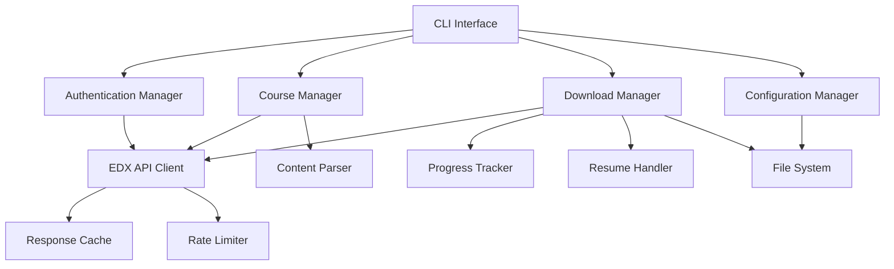

# Design Document

## Overview

The EDX Downloader modernization involves a complete architectural overhaul to address 4+ years of technical debt, API changes, and platform evolution. The design focuses on creating a robust, maintainable, and extensible system that can adapt to future EDX platform changes while providing users with a reliable course download experience.

The modernized system will use a modular architecture with clear separation between authentication, course discovery, content parsing, and download management. This approach ensures better testability, maintainability, and the ability to adapt to future EDX platform changes.

## Architecture

### High-Level Architecture



### Core Components

1. **CLI Interface**: Modern command-line interface using Click or argparse with improved UX
2. **Authentication Manager**: Handles EDX login, session management, and credential storage
3. **Course Manager**: Discovers and parses course structure and content
4. **Download Manager**: Manages video downloads with resume capability and progress tracking
5. **EDX API Client**: Centralized HTTP client with modern EDX API integration
6. **Configuration Manager**: Handles user preferences, credentials, and application settings

## Components and Interfaces

### Authentication Manager

```python
class AuthenticationManager:
    def authenticate(self, email: str, password: str) -> AuthSession
    def load_saved_credentials() -> Optional[Credentials]
    def save_credentials(credentials: Credentials) -> None
    def is_authenticated() -> bool
    def refresh_session() -> None
```

**Responsibilities:**
- Handle modern EDX authentication flows (OAuth2, CSRF tokens)
- Manage session persistence and refresh
- Secure credential storage with encryption
- Support for 2FA if required by EDX

### Course Manager

```python
class CourseManager:
    def get_course_info(self, course_url: str) -> CourseInfo
    def get_course_outline(self, course_id: str) -> CourseOutline
    def extract_video_urls(self, course_outline: CourseOutline) -> List[VideoInfo]
    def validate_enrollment(self, course_id: str) -> bool
```

**Responsibilities:**
- Parse modern EDX course URLs and extract course identifiers
- Navigate current EDX course structure and API endpoints
- Extract video metadata and download URLs
- Validate user enrollment and access permissions

### Download Manager

```python
class DownloadManager:
    def download_course(self, videos: List[VideoInfo], options: DownloadOptions) -> None
    def download_video(self, video: VideoInfo, path: str) -> DownloadResult
    def resume_download(self, partial_file: str, video: VideoInfo) -> DownloadResult
    def get_download_progress() -> ProgressInfo
```

**Responsibilities:**
- Manage concurrent downloads with rate limiting
- Implement resume functionality for interrupted downloads
- Organize files in logical directory structures
- Track progress and provide user feedback

### EDX API Client

```python
class EdxApiClient:
    def __init__(self, session: AuthSession, rate_limiter: RateLimiter)
    def get(self, endpoint: str, **kwargs) -> Response
    def post(self, endpoint: str, **kwargs) -> Response
    def get_course_data(self, course_id: str) -> Dict
    def get_video_metadata(self, block_id: str) -> Dict
```

**Responsibilities:**
- Centralize all HTTP communication with EDX
- Handle modern EDX API endpoints and authentication
- Implement proper rate limiting and retry logic
- Manage request/response caching for efficiency

## Data Models

### Core Data Structures

```python
@dataclass
class CourseInfo:
    id: str
    title: str
    url: str
    enrollment_status: str
    access_level: str

@dataclass
class VideoInfo:
    id: str
    title: str
    url: str
    quality: str
    size: Optional[int]
    duration: Optional[int]
    course_section: str

@dataclass
class DownloadOptions:
    output_directory: str
    quality_preference: str
    concurrent_downloads: int
    resume_enabled: bool
    organize_by_section: bool

@dataclass
class AuthSession:
    csrf_token: str
    session_cookies: Dict[str, str]
    expires_at: datetime
    user_id: str
```

### Configuration Schema

```python
@dataclass
class AppConfig:
    credentials_file: str = "~/.edxauth"
    cache_directory: str = "~/.cache/edx-downloader"
    default_output_dir: str = "./downloads"
    max_concurrent_downloads: int = 3
    rate_limit_delay: float = 1.0
    retry_attempts: int = 3
    video_quality_preference: str = "highest"
```

## Error Handling

### Exception Hierarchy

```python
class EdxDownloaderError(Exception):
    """Base exception for all EDX downloader errors"""

class AuthenticationError(EdxDownloaderError):
    """Authentication-related errors"""

class CourseAccessError(EdxDownloaderError):
    """Course access and enrollment errors"""

class NetworkError(EdxDownloaderError):
    """Network and API communication errors"""

class ParseError(EdxDownloaderError):
    """Content parsing and data extraction errors"""

class DownloadError(EdxDownloaderError):
    """Video download and file system errors"""
```

### Error Recovery Strategies

1. **Network Errors**: Exponential backoff with jitter, automatic retry
2. **Authentication Errors**: Clear credential cache, prompt for re-authentication
3. **Parse Errors**: Log detailed context, attempt alternative parsing methods
4. **Rate Limiting**: Respect server headers, implement adaptive delays
5. **Download Errors**: Resume capability, partial file cleanup

## Testing Strategy

### Unit Testing

- **Authentication Manager**: Mock EDX API responses, test credential handling
- **Course Manager**: Test with sample course data, validate parsing logic
- **Download Manager**: Mock file operations, test resume functionality
- **API Client**: Mock HTTP responses, test rate limiting and retries

### Integration Testing

- **End-to-End Flows**: Test complete download workflows with test courses
- **API Compatibility**: Validate against current EDX API endpoints
- **Error Scenarios**: Test error handling with various failure conditions

### Test Data Management

- Use recorded HTTP interactions for consistent testing
- Create sample course data fixtures
- Mock external dependencies (file system, network)

## Security Considerations

### Credential Management

- Encrypt stored credentials using system keyring
- Support for environment variable configuration
- Clear credentials from memory after use
- Secure session token handling

### Network Security

- Enforce HTTPS for all EDX communication
- Validate SSL certificates
- Implement proper timeout handling
- Sanitize user inputs and URLs

### Rate Limiting and Abuse Prevention

- Implement conservative default rate limits
- Monitor for unusual usage patterns
- Respect EDX robots.txt and terms of service
- Provide clear warnings about appropriate usage

## Performance Optimizations

### Caching Strategy

- Cache course metadata to reduce API calls
- Implement HTTP response caching with appropriate TTL
- Cache authentication tokens until expiration
- Store partial download progress for resume capability

### Download Optimization

- Support concurrent downloads with configurable limits
- Implement chunked downloads for large files
- Use HTTP range requests for resume functionality
- Optimize file I/O with appropriate buffer sizes

### Memory Management

- Stream large responses instead of loading into memory
- Implement proper resource cleanup
- Use generators for processing large datasets
- Monitor memory usage during bulk operations

## Migration Strategy

### Backward Compatibility

- Maintain existing CLI interface where possible
- Support existing `.edxauth` credential format
- Provide migration utilities for existing configurations
- Clear deprecation warnings for removed features

### Deployment Approach

1. **Phase 1**: Core infrastructure and authentication
2. **Phase 2**: Course discovery and parsing
3. **Phase 3**: Download management and resume capability
4. **Phase 4**: Advanced features and optimizations

### Rollback Plan

- Maintain current version as fallback option
- Provide clear migration documentation
- Support for exporting/importing configurations
- Comprehensive testing before each release